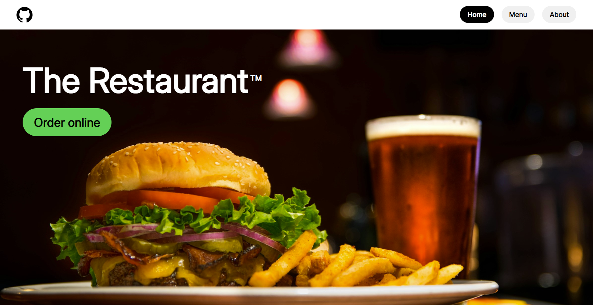
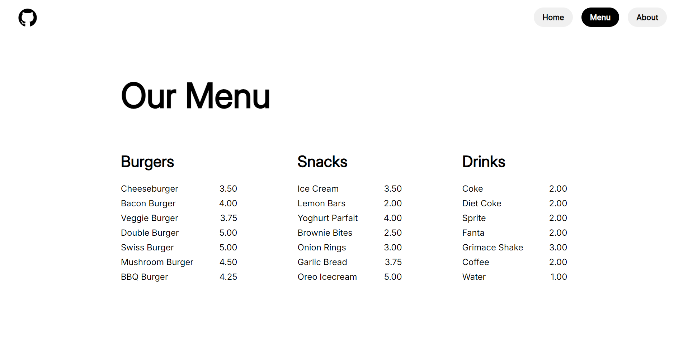

# Restaurant Page

The Odin Project - JavaScript Course Project 3:

Dynamically creating a restaurant homepage using JavaScript for DOM manipulation, HTML + CSS for layout and styling, while managing project dependencies with npm and Webpack.

## Preview

## Links

Live Link: https://luciavu.github.io/restaurant-page/

Assignment: https://www.theodinproject.com/lessons/node-path-javascript-restaurant-page

## Credits

Icon from Fontello: https://fontello.com/

Image from Unspash by:

-   Edward Franklin: https://unsplash.com/@eddie2oh
